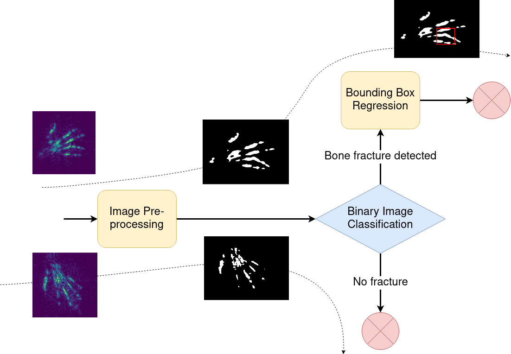

# skeleton-hackaTUM
The architecture shown below is implemented in the [main jupyter notebook](./main.ipynb). It only contains the pretrained models ready for inference.

To have a look at the underlying models, please refer to the [bounding box training notebook](./bb_training.ipynb) as well as to the [binary classification notebook](./classification_training.ipynb).